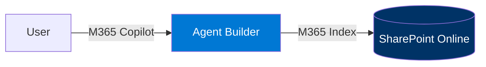
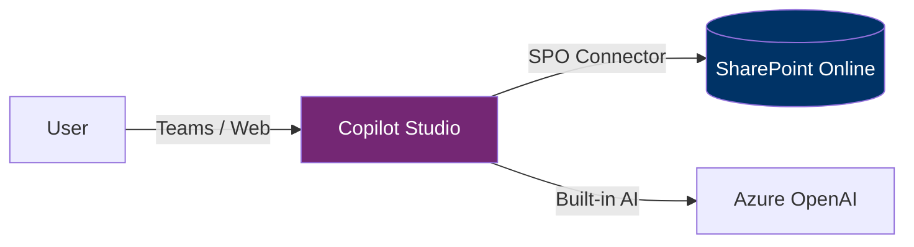
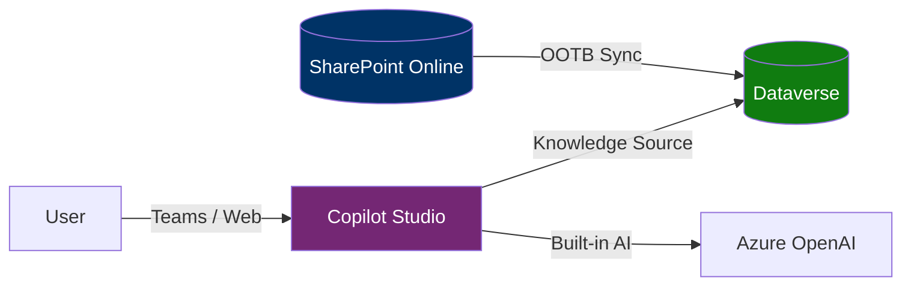
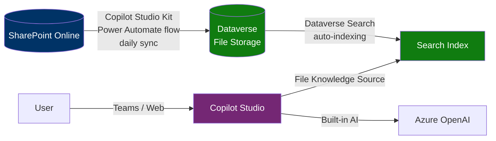
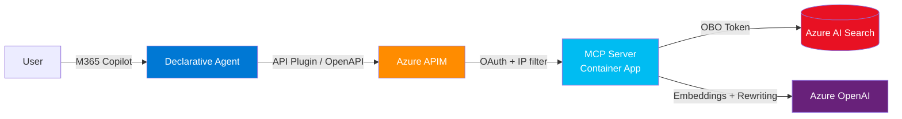
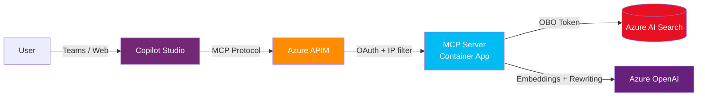
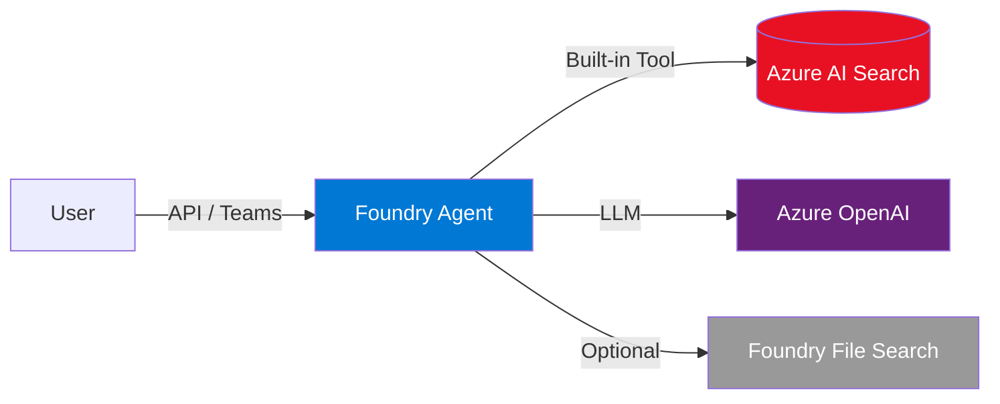
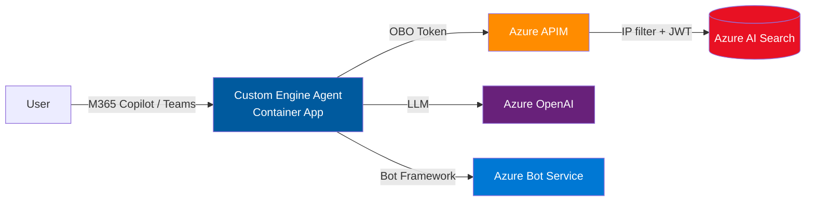
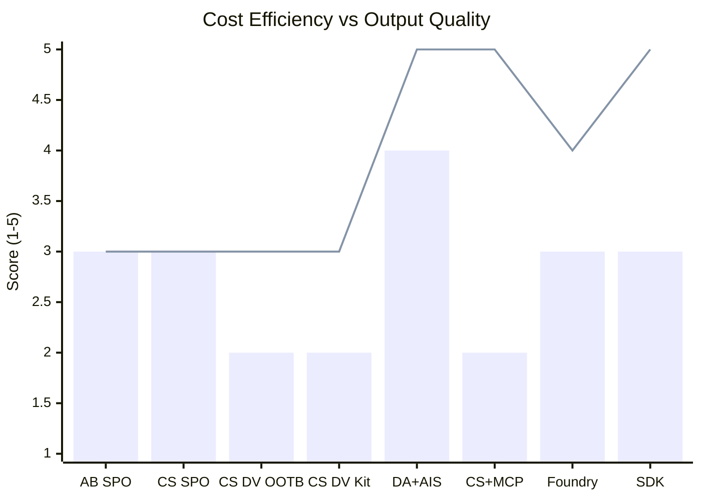
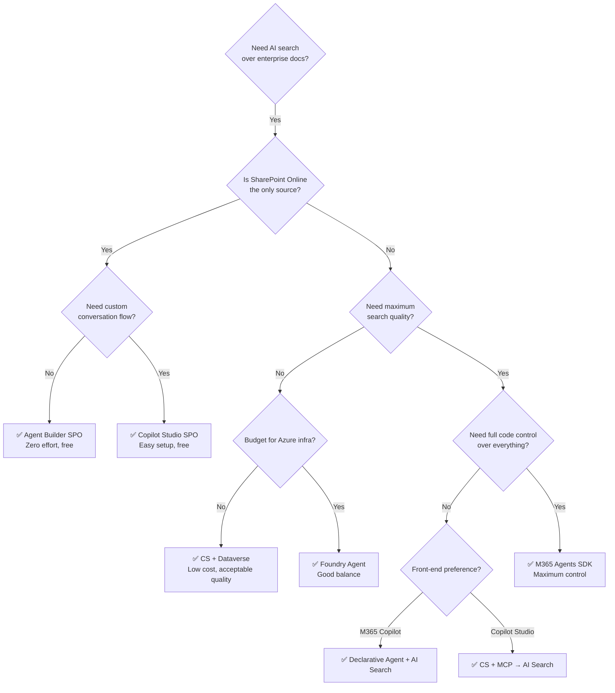

# Enterprise AI Search Agents — Comparison Matrix

> **Scenario:** 1,000 M365 users · 250 with M365 Copilot license ($30/user/month) · Enterprise org  
> **Goal:** Compare Microsoft ecosystem agents for semantic search over enterprise documents (policies, guidelines, project docs)  
> **Date:** March 2026

---

## Agent Types at a Glance

| # | Agent Type | Platform | Data Source | Code Required |
|---|-----------|----------|-------------|---------------|
| 1 | **Agent Builder (SPO)** | M365 Copilot | SharePoint Online | None |
| 2 | **Copilot Studio (SPO)** | Copilot Studio | SharePoint Online | None |
| 3 | **Copilot Studio (SPO + Dataverse OOTB)** | Copilot Studio | SPO → Dataverse (OOTB sync) | None |
| 4 | **Copilot Studio (SPO + Dataverse via Kit)** | Copilot Studio | SPO → Dataverse ([Copilot Studio Kit](https://learn.microsoft.com/en-us/microsoft-copilot-studio/guidance/kit-file-synchronization)) | Low-code / Power Automate |
| 5 | **Declarative Agent + AI Search** | M365 Copilot | Azure AI Search index | Pro-code (TypeScript) |
| 6 | **Copilot Studio + MCP → AI Search** | Copilot Studio | Azure AI Search via MCP server | Pro-code (TypeScript) |
| 7 | **Azure AI Foundry Agent** | Azure AI Foundry | Azure AI Search / Foundry file search | Low-code + config |
| 8 | **M365 Agents SDK (Custom Engine)** | Azure (self-hosted) | Azure AI Search (direct) | Pro-code (TypeScript/C#) |

---

## Architecture Diagrams

### 1 — Agent Builder (SPO)

**How it works:** Zero-config agent created in M365 Copilot. Points at SPO sites/libraries. Uses Microsoft's built-in M365 index (same index Copilot uses). No external infrastructure.

---

### 2 — Copilot Studio Agent (SPO)

**How it works:** Copilot Studio agent with SharePoint knowledge source. Uses SPO connector to retrieve documents. Built-in generative answers with RAG. Topics and conversation flow can be customized.

---

### 3 — Copilot Studio + Dataverse (OOTB Sync)

**How it works:** SPO content is synced to Dataverse using out-of-the-box Knowledge Management sync. Copilot Studio searches Dataverse knowledge articles. More structured data model than raw SPO.

---

### 4 — Copilot Studio + Dataverse (Copilot Studio Kit)

**How it works:** [Copilot Studio Kit](https://learn.microsoft.com/en-us/microsoft-copilot-studio/guidance/kit-overview) (open-source Power Platform solution by Microsoft Power CAT) syncs files from SPO to Dataverse file storage via a daily Power Automate flow. Dataverse search automatically indexes the file content. The Copilot Studio agent uses “Files” as its knowledge source — queries go through Dataverse search (NOT tenant graph grounding), resulting in lower latency and lower Copilot Credits cost (2 credits vs 12 for direct SPO). Supports larger files (up to 512 MB), more file types, and PDF non-text element indexing. Trade-off: daily sync means data is not real-time, and Dataverse search indexes are billed at ~$40/GB.

---

### 5 — Declarative Agent + AI Search

**How it works:** M365 Copilot declarative agent calls an API plugin backed by the MCP server. The MCP server (Container App) does OBO token exchange, hybrid search (text + vector + semantic reranking), and query rewriting via Azure OpenAI. 6-layer security. Full control over search quality.

---

### 6 — Copilot Studio + MCP → AI Search

**How it works:** Same Azure infrastructure as #5, but the front-end is Copilot Studio instead of a declarative agent. Copilot Studio natively connects to the MCP server. Benefits from Copilot Studio's conversation design + custom AI Search pipeline.

---

### 7 — Azure AI Foundry Agent

**How it works:** Azure AI Foundry hosted agent with Azure AI Search as a tool. Foundry manages the LLM orchestration, grounding, and response generation. Can also use Foundry's built-in file search (creates its own vector store). Evaluation and monitoring built-in.

---

### 8 — M365 Agents SDK (Custom Engine)

**How it works:** Full-code agent built with M365 Agents SDK (TypeScript). Deployed to Container App in the same VNet as MCP server. Calls AI Search **through APIM** (same enterprise security pattern as #5/#6 — IP filtering, JWT validation). Supports SSO + OBO for per-user RBAC on AI Search indexes. Surfaces in both Teams AND M365 Copilot via `copilotAgents.customEngineAgents` manifest (v1.22+). Total control over search, prompts, response formatting, conversation flow.

---

## Comparison Matrix

### Setup Effort

| # | Agent | Initial Setup | Skills Required | Time to First Demo |
|---|-------|--------------|-----------------|-------------------|
| 1 | Agent Builder (SPO) | Point-and-click in M365 | None | **< 1 hour** |
| 2 | Copilot Studio (SPO) | Copilot Studio designer | Citizen developer | **< 1 day** |
| 3 | CS + Dataverse OOTB | Studio + enable sync | Citizen developer + admin | **1–2 days** |
| 4 | CS + Dataverse Kit | Studio + install Kit + configure sync | Citizen dev + PP admin | **2–5 days** |
| 5 | Declarative Agent + AI Search | Azure infra + MCP server + agent manifest | Azure + TypeScript + Entra ID | **2–4 weeks** |
| 6 | CS + MCP → AI Search | Azure infra + MCP server + Studio config | Azure + TypeScript + Studio | **2–4 weeks** |
| 7 | Foundry Agent | Foundry project + index config | Azure + AI Foundry | **1–2 weeks** |
| 8 | M365 Agents SDK | Azure infra + bot registration + code | Azure + TypeScript/C# + Bot Framework | **3–5 weeks** |

---

### Maintenance Effort

| # | Agent | Infra to Maintain | Updates Required | Effort Level |
|---|-------|--------------------|-----------------|-------------|
| 1 | Agent Builder (SPO) | None (SaaS) | SPO permissions only | 🟢 **Minimal** |
| 2 | Copilot Studio (SPO) | None (SaaS) | Topic/flow updates | 🟢 **Minimal** |
| 3 | CS + Dataverse OOTB | Dataverse storage monitoring | Sync health checks | 🟡 **Low** |
| 4 | CS + Dataverse Kit | Kit flows + Dataverse | Sync failures, Kit updates, Dataverse storage | 🟡 **Medium** |
| 5 | Declarative Agent + AI Search | Container App, APIM, AI Search, OpenAI, Key Vault, VNet | Image updates, cert rotation, index maintenance | 🔴 **High** |
| 6 | CS + MCP → AI Search | Container App, APIM, AI Search, OpenAI, Key Vault, VNet | Same as #5 + Studio flow updates | 🔴 **High** |
| 7 | Foundry Agent | Foundry project, AI Search, OpenAI | Model updates, index reindexing | 🟡 **Medium** |
| 8 | M365 Agents SDK | App Service, AI Search, OpenAI, Bot Service | Code deployments, dependency updates | 🔴 **High** |

---

### Output Quality

| # | Agent | Search Method | Semantic Understanding | Answer Quality | Citation Quality |
|---|-------|--------------|----------------------|---------------|-----------------|
| 1 | Agent Builder (SPO) | M365 Index (keyword + semantic) | Good (M365 built-in) | ⭐⭐⭐ Good | ⭐⭐⭐ Links to SPO |
| 2 | Copilot Studio (SPO) | M365 semantic index (tenant graph grounding) | Good (M365 built-in, same as #1) | ⭐⭐⭐ Good | ⭐⭐⭐ Links to SPO |
| 3 | CS + Dataverse OOTB | Dataverse search (relevance + semantic) | Good (Dataverse semantic indexes) | ⭐⭐⭐ Good | ⭐⭐ Dataverse refs |
| 4 | CS + Dataverse Kit | Dataverse search over synced files | Good (full file content indexed, incl. PDF non-text, larger files) | ⭐⭐⭐ Good | ⭐⭐⭐ File refs |
| 5 | Declarative Agent + AI Search | Hybrid (BM25 + vector + semantic reranking) + query rewriting | Excellent | ⭐⭐⭐⭐⭐ Excellent | ⭐⭐⭐⭐ Rich metadata |
| 6 | CS + MCP → AI Search | Hybrid + query rewriting (same engine as #5) | Excellent | ⭐⭐⭐⭐⭐ Excellent | ⭐⭐⭐⭐ Rich metadata |
| 7 | Foundry Agent | AI Search (configurable) + optional vector store | Very Good | ⭐⭐⭐⭐ Very Good | ⭐⭐⭐ Configurable |
| 8 | M365 Agents SDK | AI Search (full control — any mode) | Excellent (custom) | ⭐⭐⭐⭐⭐ Excellent | ⭐⭐⭐⭐⭐ Full control |

---

### Content Filtering / Responsible AI

| # | Agent | Content Filter Type | Configurability | Indirect Prompt Injection Protection | Impact on Enterprise Docs |
|---|-------|--------------------|-----------------|------------------------------------|--------------------------|
| 1 | Agent Builder (SPO) | Microsoft built-in RAI | ❌ None | Mandatory, non-configurable | May block legitimate doc content |
| 2 | Copilot Studio (SPO) | Microsoft built-in RAI | ⚠️ Content moderation slider (High→Low) | Mandatory, non-configurable | May block legitimate doc content |
| 3 | CS + Dataverse OOTB | Microsoft built-in RAI | ⚠️ Content moderation slider | Mandatory, non-configurable | May block legitimate doc content |
| 4 | CS + Dataverse Kit | Microsoft built-in RAI | ⚠️ Content moderation slider | Mandatory, non-configurable | May block legitimate doc content |
| 5 | Declarative Agent + AI Search | Azure OpenAI content filters | ✅ Configurable per deployment | Configurable in Azure OpenAI | Full control — can adjust thresholds |
| 6 | CS + MCP → AI Search | Dual: CS RAI (response) + Azure OpenAI (search) | ⚠️ Partial — CS side is fixed, Azure side is configurable | CS-side mandatory | CS filters may still block results |
| 7 | Foundry Agent | Azure OpenAI + Foundry safety | ✅ Configurable content filters | Configurable | Good control |
| 8 | M365 Agents SDK | Azure OpenAI content filters | ✅ Fully configurable | Configurable or custom implementation | Full control |

> ⚠️ **Key finding:** Copilot Studio agents (#1–4, #6) enforce Microsoft's **indirect prompt injection protection** which cannot be disabled or configured. This filter can flag legitimate enterprise document content (especially non-English text, tables, or structured data) as a potential attack, blocking the agent's response. This is a significant limitation for enterprise document search scenarios.

---

### Ingestion Capabilities

| # | Agent | Supported Sources | Chunking Control | Metadata Enrichment | Update Frequency |
|---|-------|------------------|-----------------|--------------------|-----------------  |
| 1 | Agent Builder (SPO) | SPO sites, libraries, pages | None (M365 index) | None | Automatic (M365 crawl) |
| 2 | Copilot Studio (SPO) | SPO sites, libraries | None | None | Automatic (SPO connector) |
| 3 | CS + Dataverse OOTB | SPO → Dataverse | Minimal (OOTB) | Basic (article schema) | Scheduled sync |
| 4 | CS + Dataverse Kit | SPO (via Kit sync), supports more file types, up to 512 MB | Automatic (Dataverse search indexes file content) | Automatic (file-level metadata from SPO) | Daily sync (or on-demand) |
| 5 | Declarative Agent + AI Search | Any (Doc Intelligence, custom indexers, push API) | Full control (chunk size, overlap, strategy) | Full control (custom fields, facets, scoring profiles) | Custom (indexer schedule or push) |
| 6 | CS + MCP → AI Search | Same as #5 | Same as #5 | Same as #5 | Same as #5 |
| 7 | Foundry Agent | Files (upload or blob), AI Search index, custom data | Configurable (Foundry file search or custom) | Moderate | On upload or indexer |
| 8 | M365 Agents SDK | Any (same flexibility as #5) | Full control | Full control | Custom |

---

## Pricing Comparison

> **Assumptions:**  
> - 1,000 M365 users, 250 with M365 Copilot license ($30/user/month)  
> - 750 users WITHOUT Copilot license → use agents via **Copilot Credits** (consumption model)  
> - Copilot Credits pricing: prepaid pack ~$200/25K credits or pay-as-you-go via Azure subscription  
> - M365 Copilot licensed users: agent usage is **included at no extra charge**  
> - Usage: **20 queries/user/month** (1 per working day) → 20,000 queries/month total (5,000 from licensed users, 15,000 from non-licensed users)  
> - Azure pricing: Sweden Central region, pay-as-you-go  
> - All prices are estimated **incremental** monthly costs (USD)

### Copilot Credits — How It Works

| Billing Item | Credits per Event | M365 Copilot Licensed User |
|---|---|---|
| Classic answer (static response) | 1 credit | Free (included) |
| Generative answer (AI-generated) | 2 credits | Free (included) |
| Agent action (trigger, reasoning) | 5 credits | Free (included) |
| Tenant graph grounding (RAG over M365 data) | 10 credits | Free (included) |
| Agent flow actions (per 100 actions) | 13 credits | Free (included) |

> **Key rule:** For M365 Copilot licensed users (250), all agent interactions in M365 Copilot, Teams, or SharePoint are **zero-rated** — no Copilot Credits consumed. The 750 non-licensed users consume Copilot Credits at the rates above.  
> **Important:** SharePoint as a knowledge source uses **tenant graph grounding** (10 credits) by default — both in Agent Builder (#1) AND Copilot Studio (#2). This is the same M365 graph search. Turning off graph grounding reduces quality but drops to 2 credits/query.  
> **Dataverse is different:** Dataverse knowledge source uses its own **Dataverse search** (relevance search), which is explicitly a separate feature from tenant graph grounding — billed as generative answer only (2 credits).  
> **Source:** [Copilot Studio billing rates](https://learn.microsoft.com/en-us/microsoft-copilot-studio/requirements-messages-management) | [Knowledge sources](https://learn.microsoft.com/en-us/microsoft-copilot-studio/knowledge-copilot-studio)

### Copilot Credits Estimate for 750 Non-Licensed Users

> 750 users × 20 queries/month = **15,000 queries/month**

| # | Agent | Credits per Query (est.) | Queries/Month (750 users) | Total Credits/Month | Packs Needed (~$200/25K) | **Monthly Cost** |
|---|-------|--------------------------|--------------------------|--------------------|--------------------------|----|
| 1 | Agent Builder (SPO) | ~12 (10 graph + 2 gen answer) | 15,000 | ~180,000 | 8 packs | **~$1,600** |
| 2 | Copilot Studio (SPO) | ~12 (10 graph + 2 gen answer) | 15,000 | ~180,000 | 8 packs | **~$1,600** |
| 3 | CS + Dataverse OOTB | ~2 (generative answer — Dataverse search, NOT graph) | 15,000 | ~30,000 | 2 packs | **~$400** |
| 4 | CS + Dataverse Kit | ~2 (generative answer — Dataverse file search, NOT graph) | 15,000 | ~30,000 | 2 packs | **~$400** |
| 5 | Declarative Agent + AI Search | $0 — **free for all M365 users** (no Copilot license required). API plugin calls MCP server directly, no graph grounding, no Copilot Credits. | — | — | — | **$0** |
| 6 | CS + MCP → AI Search | ~7 (2 gen + 5 MCP tool call as agent action) | 15,000 | ~105,000 | 5 packs | **~$1,000** |
| 7 | Foundry Agent | N/A — accessed via API, not M365 | — | — | — | **$0** |
| 8 | M365 Agents SDK | N/A — accessed via Teams bot (Bot Framework) | — | — | — | **$0** |

> ⚠️ Credit consumption varies significantly based on agent design. Use the [Microsoft Copilot Studio agent usage estimator](https://microsoft.github.io/copilot-studio-estimator/) for precise estimates.

### Azure Infrastructure Costs

| # | Agent | AI Search | Azure OpenAI | Compute | Networking | Other | Subtotal (Azure) |
|---|-------|-----------|-------------|---------|------------|-------|-----------------|
| 1 | Agent Builder (SPO) | — | — | — | — | — | **$0** |
| 2 | Copilot Studio (SPO) | — | — | — | — | — | **$0** |
| 3 | CS + Dataverse OOTB | — | — | — | — | — | **$0** |
| 4 | CS + Dataverse Kit | — | — | — | — | — | **$0** |
| 5 | Declarative Agent + AI Search | S1: ~$250 | ~$30–50 (embeddings + rewriting) | Container App: ~$50–100 | VNet + NAT GW: ~$40 | APIM Consumption: ~$10, Key Vault: ~$5 | **~$385–455** |
| 6 | CS + MCP → AI Search | S1: ~$250 | ~$30–50 | Container App: ~$50–100 | VNet + NAT GW: ~$40 | APIM: ~$10, KV: ~$5 | **~$385–455** |
| 7 | Foundry Agent | Basic: ~$75 or S1: ~$250 | ~$50–100 (GPT-4o + embeddings) | Foundry hosting: included | — | Foundry project: ~$0 (pay per use) | **~$125–350** |
| 8 | M365 Agents SDK | S1: ~$250 | ~$30–50 | App Service B1: ~$55 | — | Bot Service: free (standard) | **~$335–355** |

### Dataverse / Power Platform Costs (100 GB of enterprise documents)

> **Dataverse storage pricing:**  
> - File capacity: ~$2.50/GB/month (for document files)  
> - Database capacity: ~$40/GB/month (for structured data AND search indexes)  
> - Dataverse search indexes are billed at the **database capacity rate** — for 100 GB of docs, indexes can add 30–50+ GB of database storage  
> - Source: [Dataverse capacity-based storage](https://learn.microsoft.com/en-us/power-platform/admin/capacity-storage)

| # | Agent | File Storage (100 GB docs) | Database (metadata + search indexes) | Power Automate | **Subtotal** |
|---|-------|---------------------------|-------------------------------------|---------------|--------|
| 3 | CS + Dataverse OOTB | ~$250 (100 GB × $2.50) | ~$1,200–2,000 (30–50 GB indexes × $40) | — | **~$1,450–2,250** |
| 4 | CS + Dataverse Kit | ~$250 (100 GB × $2.50) | ~$1,200–2,000 (30–50 GB indexes × $40) | — (Kit is free, uses existing PP license) | **~$1,450–2,250** |

### Total Monthly Cost Summary

| # | Agent | Copilot Credits (750 users) | Azure Infra (standalone) | Dataverse/PP | **Total Monthly** | **Annual** |
|---|-------|-----------------------------|--------------------------|--------------|-------------------|------------|
| 1 | Agent Builder (SPO) | ~$1,600 | $0 | $0 | **~$1,600** | **~$19,200** |
| 2 | Copilot Studio (SPO) | ~$1,600 | $0 | $0 | **~$1,600** | **~$19,200** |
| 3 | CS + Dataverse OOTB | ~$400 | $0 | ~$1,850 | **~$2,250** | **~$27,000** |
| 4 | CS + Dataverse Kit | ~$400 | $0 | ~$1,850 | **~$2,250** | **~$27,000** |
| 5 | Declarative Agent + AI Search | $0 | ~$710 | $0 | **~$710** | **~$8,520** |
| 6 | CS + MCP → AI Search | ~$1,000 | ~$710 | $0 | **~$1,710** | **~$20,520** |
| 7 | Foundry Agent | $0 | ~$420 ⚠️ | $0 | **~$420** ⚠️ | **~$5,040** |
| 8 | M365 Agents SDK | $0 | ~$860 | $0 | **~$860** | **~$10,320** |

> **How to read this table:**  
> - Each row shows the **full standalone cost** of deploying that agent type from scratch.  
> - **#5 and #6** use the same Azure infra (AI Search, APIM, VNet, OpenAI). If you deploy both, total Azure cost is still ~$710 (shared MCP server).  
> - **#8** uses the same shared infra as #5/#6 + its own Container App. If #5 is already deployed, #8 adds only ~$150/month.  
> - **Combined #5 + #6 + #8**: ~$860/month Azure total (shared infra + 2 Container Apps).
>
> **Ingestion costs** for 100 file changes/month: ~$2 (Doc Intelligence ~$1.50 + embeddings ~$0.07 + indexer runs: free with S1). **Negligible.**
>
> **Important notes:**  
> - The 250 M365 Copilot licensed users ($7,500/month) are a **sunk cost** — not included above.  
> - **#5** has $0 M365 cost for all 1,000 users — declarative agents are free for all M365 users.  
> - **#7 (Foundry) ⚠️ NOT enterprise-grade** — no APIM gateway, no VNet/IP filtering, no OBO per-user RBAC, no NAT Gateway for static IP. Uses Basic AI Search ($74) + OpenAI ($50–90) + Foundry hosting (included) + semantic ranker ($19). Suitable for PoC/internal use but lacks the 6-layer security of #5/#6/#8. To make Foundry enterprise-grade, you'd need the same APIM + VNet stack → similar cost to #5.  
> - **#8 includes the LLM model cost** — Azure OpenAI GPT-4o-mini for query rewriting + answer generation (~$20–40/month) is in the shared OpenAI line item.  
> - **Dataverse is the cost killer** for #3/#4 — search indexes at ~$40/GB make 100 GB of docs cost ~$1,450–2,250/month.

| # | Agent | Setup Effort | Maintenance | Output Quality | Ingestion Flexibility | Cost Efficiency | **Total /25** |
|---|-------|:----------:|:-----------:|:-------------:|:--------------------:|:--------------:|:--------:|
| 1 | Agent Builder (SPO) | ⭐⭐⭐⭐⭐ 5 | ⭐⭐⭐⭐⭐ 5 | ⭐⭐⭐ 3 | ⭐ 1 | ⭐⭐⭐ 3 | **17** |
| 2 | Copilot Studio (SPO) | ⭐⭐⭐⭐⭐ 5 | ⭐⭐⭐⭐⭐ 5 | ⭐⭐⭐ 3 | ⭐ 1 | ⭐⭐⭐ 3 | **17** |
| 3 | CS + Dataverse OOTB | ⭐⭐⭐⭐ 4 | ⭐⭐⭐⭐ 4 | ⭐⭐⭐ 3 | ⭐⭐ 2 | ⭐⭐ 2 | **15** |
| 4 | CS + Dataverse Kit | ⭐⭐⭐ 3 | ⭐⭐⭐ 3 | ⭐⭐⭐ 3 | ⭐⭐ 2 | ⭐⭐ 2 | **13** |
| 5 | Declarative Agent + AI Search | ⭐⭐ 2 | ⭐⭐ 2 | ⭐⭐⭐⭐⭐ 5 | ⭐⭐⭐⭐⭐ 5 | ⭐⭐⭐⭐ 4 | **18** |
| 6 | CS + MCP → AI Search | ⭐⭐ 2 | ⭐⭐ 2 | ⭐⭐⭐⭐⭐ 5 | ⭐⭐⭐⭐⭐ 5 | ⭐⭐ 2 | **16** |
| 7 | Foundry Agent | ⭐⭐⭐ 3 | ⭐⭐⭐ 3 | ⭐⭐⭐⭐ 4 | ⭐⭐⭐⭐ 4 | ⭐⭐⭐ 3 | **17** ⚠️ |
| 8 | M365 Agents SDK | ⭐ 1 | ⭐ 1 | ⭐⭐⭐⭐⭐ 5 | ⭐⭐⭐⭐⭐ 5 | ⭐⭐⭐ 3 | **15** |

---

## Radar Chart Data

> For use in presentations — paste into any charting tool or render with Mermaid

> **Bar** = Cost Efficiency · **Line** = Output Quality  
> AB=Agent Builder, CS=Copilot Studio, DV=Dataverse, DA=Declarative Agent, AIS=AI Search, SDK=M365 Agents SDK

---

## Decision Framework

### When to use which agent

---

## Key Takeaways

| Insight | Details |
|---------|---------|
| **Cheapest overall** | Foundry Agent (#7) at ~$420/month — but ⚠️ NOT enterprise-grade (no APIM, no VNet, no per-user RBAC). Fine for PoC/internal |
| **Cheapest enterprise-grade** | Declarative Agent + AI Search (#5) at ~$710/month — $0 M365 cost, full 6-layer security, excellent quality |
| **Best search quality** | AI Search-backed agents (#5, #6, #8) — hybrid search + semantic reranking + query rewriting |
| **Best strategy** | Deploy #5 first (~$710/month), then add #6 (+$1,000 Copilot Credits, $0 Azure) and #8 (+$150 Azure) — full coverage for ~$1,860/month |
| **Hidden cost of "free" agents** | Agent Builder (#1) and Copilot Studio SPO (#2) cost ~$1,600/month each in Copilot Credits — tenant graph grounding = 10 credits/query |
| **#5, #6, #8 share infrastructure** | AI Search, APIM, VNet, NAT GW, OpenAI are shared. Adding another agent type costs only ~$150 (Container App) |
| **Bypass Copilot Credits entirely** | Agents #5, #7, #8 serve all 1,000 users with $0 Copilot Credits |
| **Copilot license = zero marginal cost** | For the 250 Copilot-licensed users, ALL M365-based agents (#1–6) are free — zero credits consumed |
| **Dataverse is the cost killer** | Dataverse search indexes at ~$40/GB make 100 GB of docs cost ~$1,450–2,250/month in storage alone |
| **Content filtering** | Copilot Studio's mandatory indirect prompt injection filter blocks legitimate enterprise docs. AI Search agents (#5, #7, #8) give full control |

---

## Appendix: Pricing Assumptions

| Item | Price | Source |
|------|-------|--------|
| M365 Copilot license | $30/user/month | [Microsoft 365 pricing](https://www.microsoft.com/en-us/microsoft-365/copilot) |
| Azure AI Search S1 (1 SU) | ~$245/month | [AI Search pricing](https://azure.microsoft.com/en-us/pricing/details/search/) |
| Azure AI Search Basic (1 SU) | ~$74/month | Same |
| AI Search Semantic ranker | First 1,000 free, then $1/1,000 requests | Same |
| Azure OpenAI (text-embedding-3-large) | $0.00013/1K tokens | [Azure OpenAI pricing](https://azure.microsoft.com/en-us/pricing/details/cognitive-services/openai-service/) |
| Azure OpenAI (GPT-4o-mini) | $0.15/1M input tokens | Same |
| Azure Container Apps (Dedicated workload profile) | ~$150/month (enterprise) | [Container Apps pricing](https://azure.microsoft.com/en-us/pricing/details/container-apps/) |
| APIM Basic v2 (dedicated outbound IP, no VNet) | ~$150/month, 10M requests included | [APIM pricing](https://azure.microsoft.com/en-us/pricing/details/api-management/) |
| APIM Standard v2 (VNet integration) | ~$700/month, 50M requests included | Same |
| APIM Consumption (classic, no dedicated IP) | ~$3.50/million calls | Same |
| NAT Gateway | ~$32/month + data processing ~$0.045/GB | [NAT Gateway pricing](https://azure.microsoft.com/en-us/pricing/details/azure-nat-gateway/) |
| Dataverse storage (database) | ~$40/GB/month | [Power Platform pricing](https://www.microsoft.com/en-us/power-platform/products/power-apps/pricing) |
| Dataverse storage (file) | ~$2.50/GB/month | Same |
| Copilot Credits pack | ~$200/25K credits | [Copilot Studio licensing](https://learn.microsoft.com/en-us/microsoft-copilot-studio/requirements-licensing) |
| Azure Bot Service F0 | Free | [Bot Service pricing](https://azure.microsoft.com/en-us/pricing/details/bot-services/) |

> ⚠️ **Prices are estimates as of March 2026.** Always verify with the [Azure Pricing Calculator](https://azure.microsoft.com/en-us/pricing/calculator/) before making decisions.
